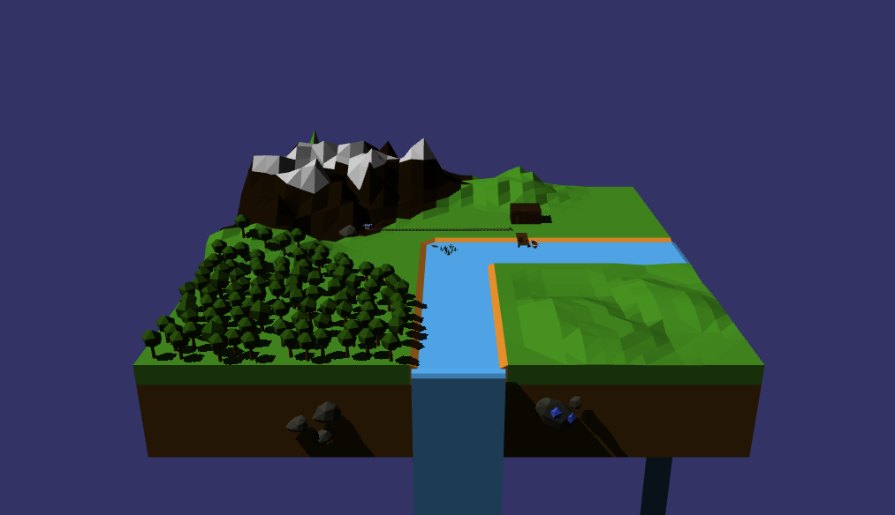

<div align="center">
  <a href="https://github.com/tomaisthorpe/tedengine/actions/workflows/ci.yaml">  
    
  </a>
  <a href="https://www.npmjs.com/package/@tedengine/ted">
      
  </a>
  <a href="https://ted.tomaisthorpe.com">
      
  </a>
</div>

# TED Engine

> [!WARNING]
> This engine is in active development. Features are missing, things are broken, breaking changes will happen frequently.

WebGL and TypeScript based game engine designed for rapid game jam development and WebGL learning purposes.



## Roadmap

- ✅ WebGL2 rendering pipeline supporting both 3D and 2D graphics
- ✅ Simple multi-threaded architecture separating game logic and rendering
- ✅ Basic audio system
- ✅ Rigid body physics with [Rapier](https://github.com/dimforge/rapier.js)
- 🚧 Entity Component System (ECS) implementation
- 🚧 Improve profiling and debug tools
- 📝 Better asset loading pipeline
- 📝 Increased test coverage
- 📝 More utilities to help with speed during game jams

## Documentation

Check out the [documentation](https://ted.tomaisthorpe.com) for guides and examples.

## Project Structure

- [`packages/ted`](packages/ted) contains the engine itself
- [`apps/docs`](apps/docs) contains documentation including some simple examples

## Development

```bash
# Build the engine library
npm run build --workspace=@tedengine/ted

# Run the documentation site locally
npm run dev --workspace=@tedengine/docs

# Run tests
npm test
```

## Example Projects
- [Ludum Dare 56](https://github.com/tomaisthorpe/ludumdare56)

## Contributing
While the engine is primarily for personal use, suggestions and feedback are welcome via issues.
